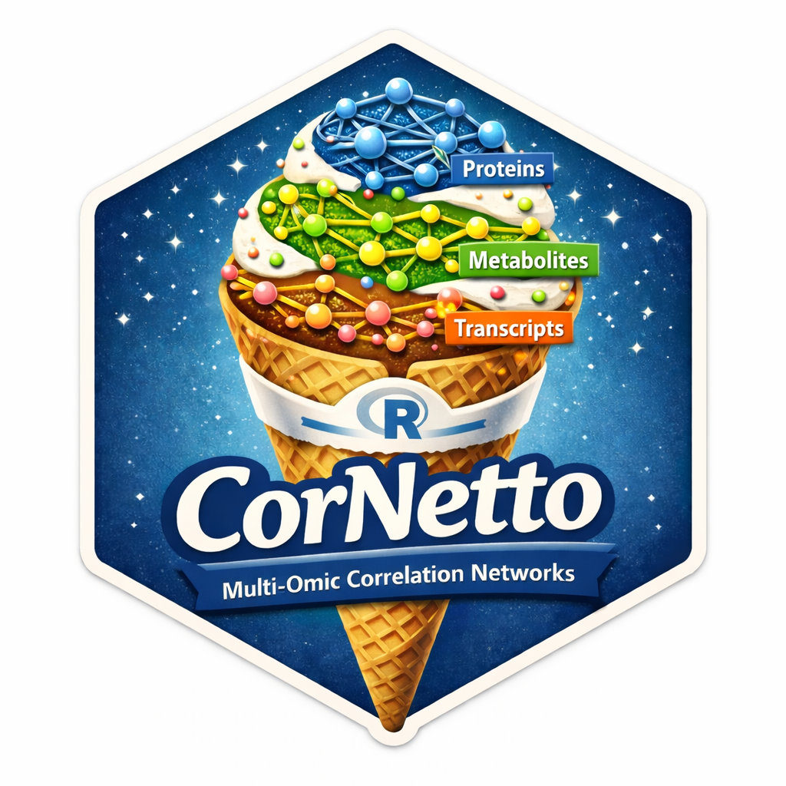

# CorNetto 

CorNetto is a Bioconductor-style R package for knowledge-guided
multi-omic correlation network analysis. It is designed for normalized
transcriptomic, proteomic, and metabolomic abundance data stored in a
`MultiAssayExperiment`.

The first package version focuses on:

- group-specific correlation networks
- pre-analysis summaries of sample counts, missingness, and feature counts
- two-group differential correlation testing, over all pairs in an assay or
  over candidate edges taken from a prior-knowledge network
- rewiring scores for perturbed nodes
- permutation-based assessment of rewiring scores
- pathway-focused subnetworks
- graph construction and Cytoscape-ready export

## Workflow

Green boxes are functions, blue boxes are the objects they return, and orange
boxes are inputs and the `MultiAssayExperiment` that carries results between
steps.


## Installation

Install CorNetto with:

```r
remotes::install_github(
    "bradleyalexward/CorNetto",
    force = TRUE
)
```

## Getting started

```r
library(CorNetto)

analysisData <- exampleAnalysisData()
knowledgeNetwork <- exampleKnowledgeNetwork()

# With assayName omitted, every assay is tested densely within-omic.
# Protein-protein and transcript-transcript pairs are included, for example,
# but protein-transcript pairs are not generated.
differentialResults <- testDifferentialCorrelation(
    analysisData,
    groupColumn = "clinicalGroup",
    groupLevels = c("Recovered", "PASC"),
    storeResult = FALSE
)

differentialNetwork <- createDifferentialCorrelationNetwork(differentialResults)
rewiringScores <- calculateRewiringScores(differentialNetwork)
```

Long permutation runs can use a BiocParallel backend. `SnowParam` is the
portable choice on Windows:

```r
backend <- BiocParallel::SnowParam(
    workers = 2,
    type = "SOCK",
    stop.on.error = TRUE,
    progressbar = FALSE
)

rewiringValidation <- permuteRewiringScores(
    analysisData,
    candidateEdgeTable = knowledgeNetwork,
    groupColumn = "clinicalGroup",
    groupLevels = c("Recovered", "PASC"),
    minimumAbsoluteCorrelation = 0,
    adjustedPValueThreshold = NULL,
    nPermutations = 999,
    seed = 1,
    verbose = TRUE,
    progressEvery = 300,
    BPPARAM = backend
)
```

See `vignette("CorNetto")` for the full workflow.

## Citation

If you use or build upon CorNetto, please cite:

Ward B<sup>1,2</sup>, Gatto L<sup>3</sup>, Balligand J-L<sup>4</sup>,
Bamps L<sup>5</sup>, Cani PD<sup>6</sup>, De Greef J<sup>2,5</sup>,
Dewulf JP<sup>2,7,8</sup>, Haufroid V<sup>2,8</sup>,
Kabamba B<sup>8,9</sup>, Pyr dit Ruys S<sup>1</sup>,
Vertommen D<sup>10</sup>, Yombi JC<sup>5</sup>,
Belkhir L<sup>2,5,\*</sup>, Elens L<sup>1,2,\*</sup> (2026).
CorNetto: Knowledge-Guided Multi-Omic Correlation Network Analysis.
R package version 1.0.
https://github.com/bradleyalexward/CorNetto

<sub>
1. Integrated Pharmacometrics, Pharmacogenomics and Pharmacokinetics Group
   (PMGK), Louvain Drug Research Institute (LDRI), UCLouvain, Université
   Catholique de Louvain, Brussels, 1200, Belgium
2. Louvain Center for Toxicology and Applied Pharmacology (LTAP), Institut de
   Recherche Expérimentale et Clinique (IREC), UCLouvain, Université
   Catholique de Louvain, Brussels, 1200, Belgium
3. Computational Biology and Bioinformatics Unit (CBIO), de Duve Institute,
   UCLouvain, Université Catholique de Louvain, Brussels, 1200, Belgium
4. WELBIO (Walloon Excellence in Life Sciences and Biotechnology), Pole of
   Pharmacology and Therapeutics (FATH), Institut de Recherche Expérimentale
   et Clinique (IREC), Cliniques Universitaires Saint-Luc, UCLouvain,
   Université Catholique de Louvain, Brussels, 1200, Belgium
5. Department of Internal Medicine, Cliniques Universitaires Saint-Luc,
   UCLouvain, Université Catholique de Louvain, Brussels, 1200, Belgium
6. WELBIO, Metabolism and Nutrition Research Group, Louvain Drug Research
   Institute (LDRI), UCLouvain, Université Catholique de Louvain, Brussels,
   1200, Belgium
7. Department of Biochemistry, de Duve Institute, UCLouvain, Université
   Catholique de Louvain, Brussels, 1200, Belgium
8. Department of Laboratory Medicine, Cliniques Universitaires Saint-Luc,
   UCLouvain, Université Catholique de Louvain, Brussels, 1200, Belgium
9. Pôle de Microbiologie, Institut de Recherche Expérimentale et Clinique,
   UCLouvain, Université Catholique de Louvain, Brussels, 1200, Belgium
10. de Duve Institute and MASSPROT Platform, UCLouvain, Université Catholique
    de Louvain, Brussels, 1200, Belgium

\* Joint senior authors. Correspondence: laure.elens@uclouvain.be (L.E.);
leila.belkhir@saintluc.uclouvain.be (L.B.).
</sub>

You can also retrieve the package citation from R:

```r
citation("CorNetto")
```

A machine-readable citation is available in `CITATION.cff`.


## License

CorNetto is released under the Artistic License 2.0.
