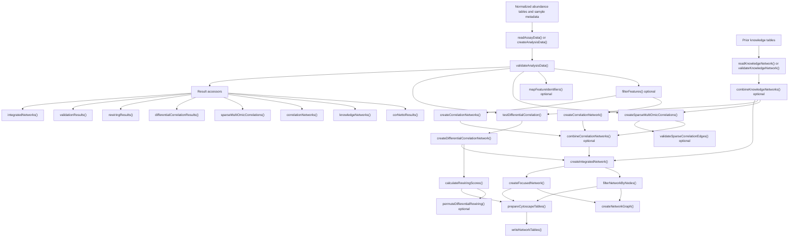

# CorNetto Function Workflow

This document summarizes where each exported CorNetto function fits in
the package workflow, what it accepts, what it returns, and when to use
it. It is intended as a quick review document for maintainers,
reviewers, and users before running the full vignette.

## Overall Workflow

## Function Reference

| Function | Main input | Main output | Role in workflow |
| --- | --- | --- | --- |
| `readAssayData()` | Delimited normalized abundance table | `SummarizedExperiment` | Reads one assay from disk and creates the row metadata CorNetto expects. |
| `createAnalysisData()` | Named assay list and sample metadata | `MultiAssayExperiment` | Creates the central analysis object from normalized assays. |
| `validateAnalysisData()` | `MultiAssayExperiment` | Validated `MultiAssayExperiment` | Checks numeric assays, unique feature IDs, unique sample IDs, and sample metadata alignment. |
| `filterFeatures()` | `MultiAssayExperiment` | Filtered `MultiAssayExperiment` | Reduces assay size before network inference by feature subset, variance threshold, or top variable features. |
| `mapFeatureIdentifiers()` | `MultiAssayExperiment` | Feature mapping `DataFrame` | Returns assay-specific feature identifiers and display names for checking priors and labeling outputs. |
| `readKnowledgeNetwork()` | Delimited prior-network table | Standardized edge `DataFrame` | Reads and standardizes prior knowledge from disk, with optional column remapping. |
| `validateKnowledgeNetwork()` | In-memory prior-network table | Standardized edge `DataFrame` | Validates and standardizes prior knowledge that is already loaded in R. |
| `combineKnowledgeNetworks()` | One or more prior-network tables | Standardized edge `DataFrame` | Merges prior sources such as PPI, TF-target, RNA-protein, and protein-metabolite networks. |
| `createCorrelationNetwork()` | One assay and one sample group | Standardized edge `DataFrame` | Computes dense within-omic correlations for one assay-group combination. |
| `createCorrelationNetworks()` | Multiple assays and groups | Named list or stored results | Runs dense within-omic correlation construction across assays and groups. |
| `createSparseMultiOmicCorrelations()` | Analysis object and prior network | Standardized edge `DataFrame` | Computes correlations only for prior-supported feature pairs, with scope set to all, within-omic, or cross-omic candidate edges. |
| `combineCorrelationNetworks()` | Dense and sparse dynamic edge tables | Standardized edge `DataFrame` | Merges compatible dynamic correlation layers for integration. |
| `testDifferentialCorrelation()` | Analysis object and two group labels | Standardized edge `DataFrame` | Tests whether correlations differ between two groups for all pairs or candidate prior-supported pairs. |
| `createDifferentialCorrelationNetwork()` | Differential-correlation test table | Standardized edge `DataFrame` | Filters differential results, assigns rewiring labels, and creates weighted differential edges. |
| `calculateRewiringScores()` | Differential-correlation network | Node-level `DataFrame` | Calculates raw, root-mean-square, and degree-matched node rewiring scores. |
| `validateSparseCorrelationEdges()` | Analysis object and prior network | Validation `DataFrame` | Estimates empirical sparse-edge p-values by permuting sample alignment before recomputing correlations. |
| `permuteDifferentialRewiring()` | Analysis object and two group labels | Validation result list | Estimates empirical rewiring p-values by permuting group labels and rerunning the differential-correlation workflow. |
| `createIntegratedNetwork()` | Prior, correlation, sparse, and differential layers | Standardized edge `DataFrame` | Merges static knowledge and dynamic edge layers into one multi-omic network. |
| `filterNetworkByNodes()` | Edge table and node identifiers | Standardized edge `DataFrame` | Keeps edges touching selected nodes or edges internal to a node set. |
| `createFocusedNetwork()` | Edge table and seed nodes | Standardized edge `DataFrame` | Builds a neighborhood-induced subnetwork around pathway or feature seed nodes. |
| `createNetworkGraph()` | Standardized edge table | `igraph` object | Converts CorNetto edge tables into graph objects for downstream analysis or plotting. |
| `plotRewiringScores()` | Rewiring-score table | Invisibly returns plotted subset | Creates a base R barplot of top rewired nodes. |
| `prepareCytoscapeTables()` | Edge table and optional rewiring table | List with `nodes` and `edges` | Creates Cytoscape-ready node and edge tables, merging rewiring scores into node metadata when supplied. |
| `writeNetworkTables()` | Cytoscape table list | Written files and paths | Writes node and edge tables as TSV or CSV files. |
| `exampleAnalysisData()` | None | Synthetic `MultiAssayExperiment` | Loads the small example analysis object used in examples, tests, and the vignette. |
| `exampleKnowledgeNetwork()` | None | Synthetic prior-network `DataFrame` | Loads the small example prior network. |
| `exampleSeedNodes()` | None | Character vector | Loads the small example seed-node set. |
| `corNettoResults()` | `MultiAssayExperiment` | CorNetto metadata store | Returns all stored CorNetto result lists. |
| `knowledgeNetworks()` | `MultiAssayExperiment` | Stored knowledge networks | Accessor for stored prior-network results. |
| `correlationNetworks()` | `MultiAssayExperiment` | Stored dense or combined correlation networks | Accessor for stored dense or combined correlation-network results. |
| `sparseMultiOmicCorrelations()` | `MultiAssayExperiment` | Stored sparse multi-omic networks | Accessor for stored sparse multi-omic correlation results. |
| `differentialCorrelationResults()` | `MultiAssayExperiment` | Stored differential-correlation results | Accessor for stored differential-correlation test results. |
| `rewiringResults()` | `MultiAssayExperiment` | Stored rewiring results | Accessor for stored node-level rewiring scores. |
| `validationResults()` | `MultiAssayExperiment` | Stored validation results | Accessor for stored permutation-validation outputs. |
| `integratedNetworks()` | `MultiAssayExperiment` | Stored integrated networks | Accessor for stored integrated multi-omic networks. |

## Typical Branch Points

Use dense correlations when the assay has a manageable number of
features and an exploratory within-omic network is useful.

Use sparse multi-omic correlations when an assay is large, when only
prior-supported within-assay edges should be tested, or when cross-omic
dynamic edges should be constrained by prior knowledge. Use
`correlationScope = "withinOmic"` or `"crossOmic"` when the analysis
should be restricted to one candidate-edge class.

Use `candidateEdgeTable` in `testDifferentialCorrelation()` when the
differential question should be restricted to prior-supported edges or to
edges already identified in a previous analysis step.

Use `validateSparseCorrelationEdges()` when edge-level empirical
significance is required, and `permuteDifferentialRewiring()` when
node-level rewiring scores need empirical p-values from group-label
permutation.

Use `filterNetworkByNodes()` for direct node-set filtering, and
`createFocusedNetwork()` when first- or second-neighbor expansion around
pathway seeds is required.
