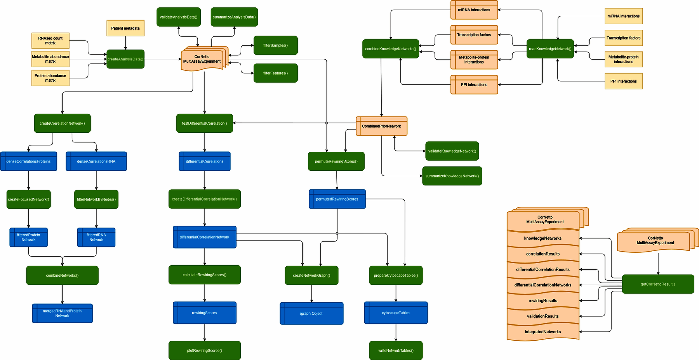

```{r setup, include = FALSE}
knitr::opts_chunk$set(collapse = TRUE, comment = "#>")
library(CorNetto)
```

# Introduction

CorNetto builds knowledge-guided multi-omic correlation networks from
normalized assay data stored in a `MultiAssayExperiment`. It is intended
for workflows where transcriptomic, proteomic, metabolomic, or related
assays are already normalized and the analysis question is whether
groups differ in correlation structure, prior-supported connectivity, or
node-level rewiring.

The package uses standard Bioconductor containers for assay and sample
metadata, and returns standardized edge tables that can be combined,
converted to `igraph` objects, or exported as Cytoscape-ready node and
edge tables.

CorNetto is for downstream analysis after assay-level preprocessing. It
uses Bioconductor containers, implements the Fisher z-difference test for
differential correlation, and uses `igraph` for graph representation. The
package adds the glue needed for prior-guided
candidate-edge differential correlation, knowledge-network-aware
integration, focused subnetworks, and rewiring summaries in a single
reproducible workflow.

# Relationship to existing Bioconductor software

The Bioconductor package [dcanr](https://bioconductor.org/packages/dcanr)
provides several methods and an evaluation framework for differential
co-expression or association network inference. CorNetto has a narrower
role. It works directly with `MultiAssayExperiment`, tests prespecified
within- or cross-assay edges from heterogeneous prior networks, and carries
those results through network integration and node-level rewiring summaries.
It is therefore complementary to dcanr rather than a replacement for its
method-comparison and benchmarking framework.

# Workflow overview

Green boxes are CorNetto functions, blue boxes are the objects they
return, and orange boxes are inputs and the `MultiAssayExperiment` that
carries results between steps. The three columns are independent entry
points: group-specific correlation networks on the left, differential
correlation and rewiring in the centre, and prior-knowledge assembly on
the right.

```{r workflow-flowchart, echo = FALSE, out.width = "100%", fig.cap = "The CorNetto workflow, from input data and prior knowledge through to rewiring validation and export."}

```

# Version information

```{r version-information}
c(
    R = R.version.string,
    Bioconductor = as.character(BiocManager::version()),
    CorNetto = as.character(utils::packageVersion("CorNetto"))
)
```

# Installation

After acceptance to Bioconductor, install CorNetto with:

```{r install, eval = FALSE}
if (!requireNamespace("BiocManager", quietly = TRUE)) {
    install.packages("BiocManager")
}
BiocManager::install("CorNetto")
```

# Example data

```{r load-data}
analysisData <- exampleAnalysisData()
knowledgeNetwork <- exampleKnowledgeNetwork()
seedNodes <- exampleSeedNodes()

analysisData
summarizeAnalysisData(analysisData, groupColumn = "clinicalGroup", quiet = TRUE)
head(knowledgeNetwork)
seedNodes
```

The synthetic example contains three assays named `protein`,
`transcript`, and `metabolite`. The example prior network also contains a
drug-target edge to demonstrate that prior networks can include static
knowledge beyond the measured assays. Prior-guided candidate-edge
analyses must therefore be given only prior edges whose assay names are
present in the analysis object.

```{r measured-priors}
measuredAssays <- c("protein", "transcript", "metabolite")
measuredKnowledgeNetwork <- knowledgeNetwork[
    knowledgeNetwork$fromAssayName %in% measuredAssays &
        knowledgeNetwork$toAssayName %in% measuredAssays,
    ,
    drop = FALSE
]
```

# Dense group-specific correlations

`createCorrelationNetwork()` computes all pairwise within-omic
correlations for one assay and one group. Dense all-pairs mode is
intended for small-to-medium assays; for large assays, prefer
prior-guided candidate-edge testing when suitable.

```{r dense-correlations}
recoveredProteinNetwork <- createCorrelationNetwork(
    analysisData = analysisData,
    assayName = "protein",
    groupColumn = "clinicalGroup",
    groupLevel = "Recovered",
    correlationMethod = "pearson",
    minimumAbsoluteCorrelation = 0,
    adjustedPValueThreshold = 1,
    pAdjustMethod = "fdr",
    storeResult = FALSE
)

head(recoveredProteinNetwork)
```

# Prior-guided sparse differential correlation

`testDifferentialCorrelation()` can test only feature pairs supported by
a prior network when `candidateEdgeTable` is supplied. This is the sparse
mode for differential correlation: it avoids exhaustive cross-omic
testing and keeps the dynamic network aligned to interpretable prior
knowledge.

```{r prior-guided-differential}
priorGuidedDifferentialResults <- testDifferentialCorrelation(
    analysisData = analysisData,
    candidateEdgeTable = measuredKnowledgeNetwork,
    groupColumn = "clinicalGroup",
    groupLevels = c("PASC", "Recovered"),
    minimumAbsoluteCorrelation = 0,
    adjustedPValueThreshold = 1,
    pAdjustMethod = "fdr",
    storeResult = FALSE
)

priorGuidedDifferentialNetwork <- createDifferentialCorrelationNetwork(
    differentialCorrelationTable = priorGuidedDifferentialResults,
    minimumAbsoluteCorrelation = 0
)

c(nrow(priorGuidedDifferentialResults), nrow(priorGuidedDifferentialNetwork))
```

# Permutation validation

`permuteRewiringScores()` permutes group labels, recomputes the
differential-correlation statistics over a fixed edge universe, and compares
each node's observed rewiring score with the permutation distribution.
When both `candidateEdgeTable` and `assayName` are omitted, that universe is
built from dense within-omic pairs in every assay; cross-omic pairs are not
generated.

The fixed edge set is attempted in every permutation. An edge can still
be unscored if a permuted group has insufficient pairwise-complete data or a
constant feature, and `contributingPermutations` records the resulting loss.
Supplying `candidateEdgeTable` with all observed-data filters disabled, as
below, lets CorNetto fix the candidate universe before inspecting the group
labels. The result is marked as a randomization p-value only when every edge
and the selected node score are estimable under the permitted allocations. The
user is still responsible for prespecifying the candidates and for the
exchangeability assumption.

```{r permutation-validation}
rewiringValidation <- permuteRewiringScores(
    analysisData = analysisData,
    candidateEdgeTable = measuredKnowledgeNetwork,
    groupColumn = "clinicalGroup",
    groupLevels = c("PASC", "Recovered"),
    minimumAbsoluteCorrelation = 0,
    adjustedPValueThreshold = NULL,
    pAdjustMethod = "fdr",
    nPermutations = 99,
    seed = 1
)

head(rewiringValidation$rewiringTable)
rewiringValidation$inferenceStatus
```

For a fully scored node, the smallest tail probability is
`1 / (nPermutations + 1)`, so 99 permutations bottom out at 0.01.
`contributingPermutations` records how many permutations produced a score for
each node. Treat the values as conditional rankings whenever
`inferenceStatus` says so.

Long runs can be parallelized by supplying a BiocParallel backend. On Windows,
use a socket backend. Keep package examples and automated checks at two workers
or fewer:

```{r parallel-permutations, eval=FALSE}
backend <- BiocParallel::SnowParam(
    workers = 2,
    type = "SOCK",
    stop.on.error = TRUE,
    progressbar = FALSE
)

parallelValidation <- permuteRewiringScores(
    analysisData = analysisData,
    candidateEdgeTable = measuredKnowledgeNetwork,
    groupColumn = "clinicalGroup",
    groupLevels = c("PASC", "Recovered"),
    minimumAbsoluteCorrelation = 0,
    adjustedPValueThreshold = NULL,
    nPermutations = 999,
    seed = 1,
    verbose = TRUE,
    progressEvery = 300,
    BPPARAM = backend
)
```

# Differential correlation and rewiring

`testDifferentialCorrelation()` compares correlation coefficients between
two groups. `createDifferentialCorrelationNetwork()` converts the test
results to a weighted network, and `calculateRewiringScores()` summarizes
node-level rewiring. When `assayName` is omitted, every assay is tested, but
pairs are generated only within each assay: protein-protein and
transcript-transcript pairs are included, for example, whereas
protein-transcript pairs are not.

```{r differential-correlation}
differentialResults <- testDifferentialCorrelation(
    analysisData = analysisData,
    groupColumn = "clinicalGroup",
    groupLevels = c("PASC", "Recovered"),
    correlationMethod = "pearson",
    minimumAbsoluteCorrelation = 0,
    adjustedPValueThreshold = 1,
    pAdjustMethod = "fdr",
    storeResult = FALSE
)

differentialNetwork <- createDifferentialCorrelationNetwork(
    differentialCorrelationTable = differentialResults,
    minimumAbsoluteCorrelation = 0
)

rewiringScores <- calculateRewiringScores(
    differentialCorrelationNetwork = differentialNetwork,
    storeResult = FALSE
)

head(rewiringScores)
```

The three scores are descriptive, not tests. `rawRewiringScore` is the L2
norm of a node's incident z-scores and grows with degree.
`rootMeanSquareRewiringScore` divides that by `sqrt(degree)` and is the one
to compare across nodes of different degree. `degreeMatchedZScore`
standardizes within bins of `log2(degree + 1)`, so it is a within-bin
ranking aid rather than a z-score against a null model; it is `NA` for bins
holding fewer than five nodes, since a smaller bin cannot produce a
meaningful spread. `permuteRewiringScores()` adds a permutation reference;
its `inferenceStatus` states whether the result meets the computational
conditions for randomization inference.

Features are mutually tested only against features in the same assay. In this
example, each protein and transcript node therefore has degree four, while
each metabolite node has degree three. On a real network with a spread of
degrees, the bins do the work they are named for.

# Integrated and focused network

`combineNetworks()` merges static prior knowledge,
group-specific correlation layers, and differential-correlation layers.
`createFocusedNetwork()` extracts a seed-centered neighborhood, which is
useful for pathway-driven analyses.

```{r integrated-network}
integratedNetwork <- combineNetworks(
    knowledgeNetwork = knowledgeNetwork,
    correlationNetwork = recoveredProteinNetwork,
    differentialCorrelationNetwork = list(
        priorGuidedDifferentialNetwork,
        differentialNetwork
    ),
    includeReverseEdges = TRUE
)

focusedNetwork <- createFocusedNetwork(
    networkEdgeTable = integratedNetwork,
    seedNodes = seedNodes,
    neighborhoodOrder = 1
)

cytoscapeTables <- prepareCytoscapeTables(
    networkEdgeTable = focusedNetwork,
    rewiringTable = rewiringScores
)

names(cytoscapeTables)
nrow(cytoscapeTables$nodes)
nrow(cytoscapeTables$edges)
```

# Graph creation

`createNetworkGraph()` converts a standardized CorNetto edge table to an
`igraph` object. Plotting can then use standard igraph methods.

```{r graph-plot, fig.width = 8, fig.height = 6}
graphObject <- createNetworkGraph(focusedNetwork)
plot(
    graphObject,
    layout = igraph::layout_with_fr(graphObject),
    vertex.label = NA,
    vertex.size = 8,
    edge.width = 1,
    main = "Example focused CorNetto network"
)
```

# Export

Use `writeNetworkTables()` when Cytoscape-ready files are needed. The
example writes to a temporary directory.

```{r export}
writtenFiles <- writeNetworkTables(
    networkTables = cytoscapeTables,
    directoryPath = tempdir(),
    prefix = "cornettoExample",
    fileFormat = "tsv"
)

basename(writtenFiles)
```

# Session information

```{r session-info}
sessionInfo()
```
